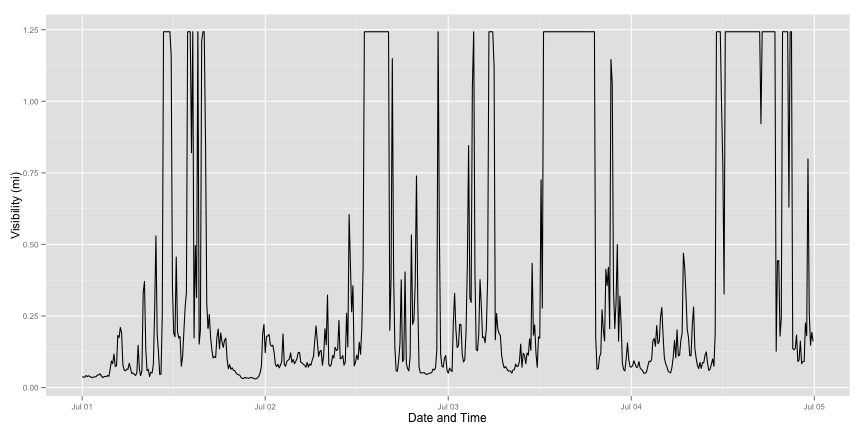

## Introduction

* Data
* Application
* Interpretation

--- .class #id 

## Data Source

* Visibility in miles
* By Mile marker
* From roadside environmental sensor stations (ESS)

---

## Application

* Shiny App
* Select date range
* Select one or more ESS

---

## Example Output

 

---

## Interpretation

* Visibility changes quickly
* There can be extended periods of low visibility
